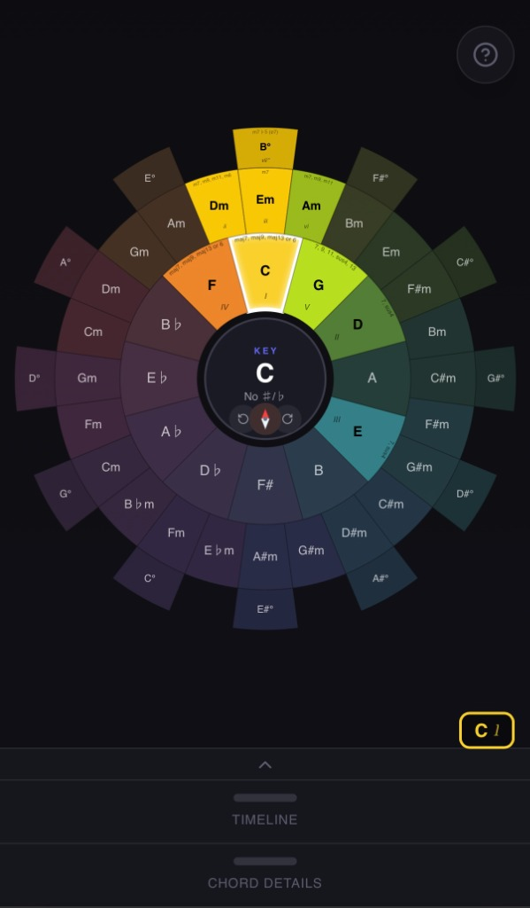
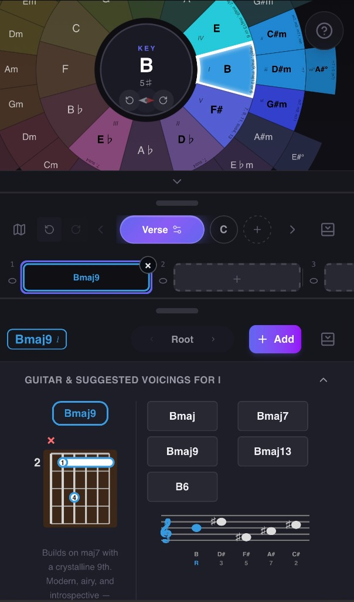
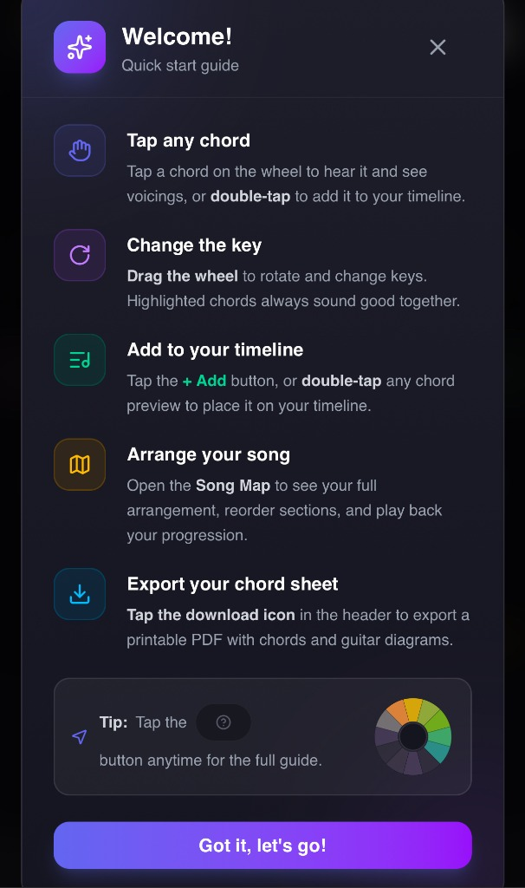
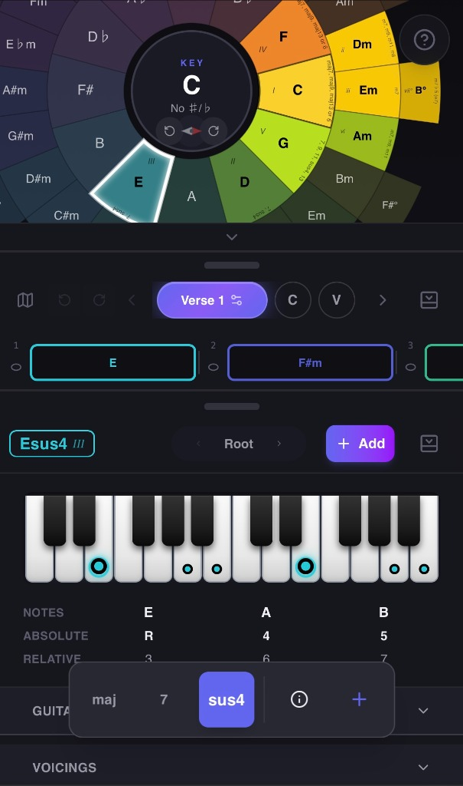
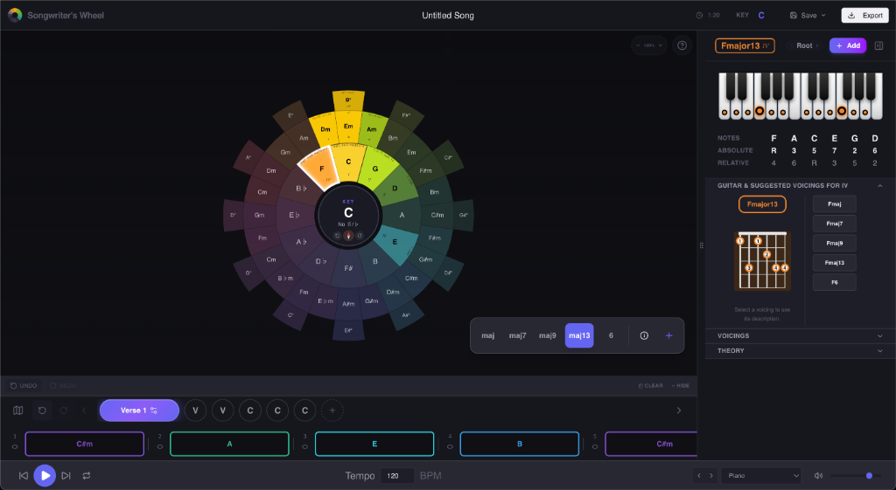
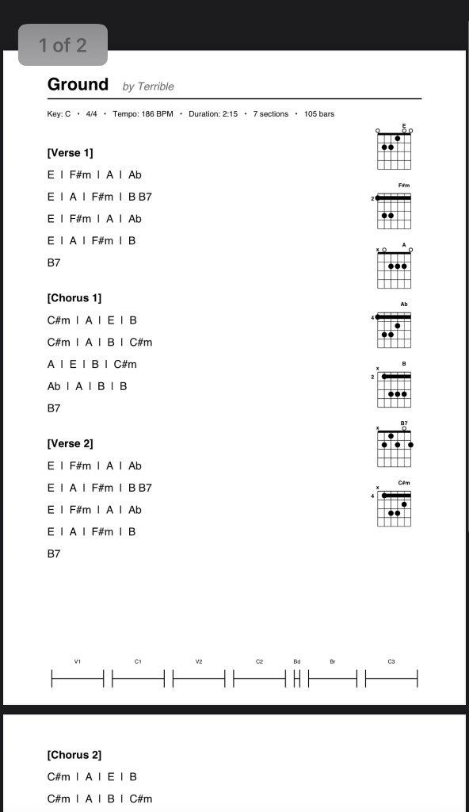

# 🎵 Songwriter Wheel

A fun, educational, and practical web app for musicians and songwriters to brainstorm ideas, explore music theory, reference guitar and keyboard diagrams, create chord progressions, hear any chord/voicing combo with real sampled instruments, create & arrange complete songs, and one-tap export PDF chord sheets.

**🎸 [Try it live →](https://songwriterwheel.com)**

---

<p align="center">
  
  
  
  
</p>

---

## ✨ Features

### 🎡 Interactive Chord Wheel
Built around the classic **Chord Wheel** concept — a circle of fifths on the inner ring, relative minor chords on a middle ring, and diminished chords on the outer ring. This makes it easy to see which chords in any key work well together and experiment with different sounds.

<p align="center">
  
</p>

### 🎹 Chord Exploration
- **Hear different voicings** — Select a chord and explore various voicings suggested for your key
- **See guitar fingerings** — View chord diagrams for any chord and voicing
- **Keyboard visualization** — See chords displayed on a piano keyboard
- **Staff notation** — View chords in standard musical notation
- **Inversions** — Hear and explore different chord inversions

### 🎼 Song Creation
- **Build chord progressions** — Easily create progressions by tapping chords on the wheel
- **Loop, listen, & brainstorm** — Cycle a section with different instruments while ideas percolate
- **Multi-section arrangements** — Organize your song with intro, verse, chorus, bridge, and custom sections
- **Playback** — Listen to your progressions with adjustable BPM
- **Section management** — Duplicate, reorder, and customize sections

<p align="center">
  
</p>

### 📄 PDF Export
With one click, export a beautifully formatted, printable **chord sheet** of your song complete with:
- Guitar chord diagrams for all chords in your song
- Song info (title, artist, key, BPM)
- Visual song timeline/structure at the bottom of the page

<p align="center">
  
  <br />
  <em><a href="https://terribleisalright.bandcamp.com/track/ground-2"><ins>"Ground" by Terrible</ins></a></em>
</p>

### 📚 Music Theory Education
Tap the **"?"** icon to access interactive music theory lessons and songwriting tips, helping you understand *why* certain chords work well together.

<p align="center">
  
    
</p>

### 🎸 Famous Progressions
Explore and learn from famous chord progressions used in popular songs, and use them as starting points for your own creations.

---


## 🚀 Getting Started

### Prerequisites
- Node.js 18+
- npm or yarn

### Installation

```bash
# Clone the repository
git clone https://github.com/shhawkins/songwriter-wheel.git
cd songwriter-wheel

# Install dependencies
npm install

# Start the development server
npm run dev
```

The app will be available at `http://localhost:5173`

### Build for Production

```bash
npm run build
```

## 🛠️ Tech Stack

- **React** — UI framework
- **TypeScript** — Type-safe JavaScript
- **Vite** — Fast build tool and dev server
- **Tone.js** — Audio synthesis and playback
- **Tailwind CSS** — Utility-first styling
- **jsPDF** — PDF generation

## 🗺️ Roadmap

- [ ] Improved timeline interaction
- [ ] Add more custom voices from live sampled instruments
- [ ] MIDI export — Load your song into a DAW and keep developing your ideas
- [ ] More interactive music theory modules
- [ ] Additional songwriting prompts and exercises
- [ ] Alternate tuning support (Drop D, DADGAD, Open G, etc.)
- [ ] Generate chord charts for various guitar voicings of the same chord
- [ ] Interactive module for exploring scales and modes
- [ ] Additional instrument voicings
- [ ] Song saving/loading to cloud

## 💬 Feedback

Have ideas, suggestions, or found a bug? I'd love to hear from you! [Open an issue on GitHub](https://github.com/shhawkins/songwriter-wheel/issues) and let me know.

---

*Built with ❤️ for musicians and songwriters everywhere.*
